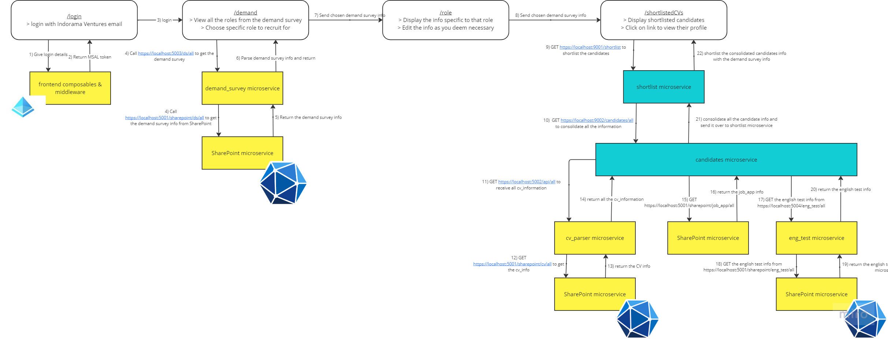

# HR-recruitment-system
A comprehensive web application designed to optimize the recruitment process through automated analysis of job applications and CVs, facilitating efficient shortlisting of candidates aligned with job roles.

## Project Overview:
This application leverages modern technologies to streamline the recruitment workflow. It integrates with SharePoint for data storage, automates data extraction, parses CVs, conducts English proficiency tests, and employs keyword matching to align candidates with job requirements effectively.

This project was built with maintainability and scalability in mind, utilizing a microservices architecture to ensure modularity and flexibility. The system comprises complex and simple microservices, each serving a specific function to enhance the recruitment process.

## Workflow:

The architecture is built around SharePoint as the primary data storage solution, ensuring seamless integratino and data management with legacy systems.

## Microservices
### Complex microservices
1. **Shortlist (9001)** - Python, Flask
2. **Candidates (9002)** - Python, Quart

### Simple microservices
1. **SharePoint Wrapper (5001)** - Python, Flask
2. **CV Parser (5002)** - Typescript, Next.js
3. **Demand Survey (5003)** - Python, Flask
4. **English test (5004)** - Python, Flask

## Frontend
The frontend is powered by Nuxt.js version 3.12, ensuring a responsive and dynamic user interface. It is designed to be user-friendly and intuitive, providing a seamless experience for recruiters and candidates. 

## Installing the HR-recruitment-system
Generally, you should install the HR-recruitment-system by building and running the Dockerfile, which contains all the dependencies you need. 
1. **Launch Docker Desktop**: Ensure Docker Desktop is installed and running on your machine.

2. **Clone the repository**: Use the following command to clone the repository and navigate to the proejct directory.
```bash
git clone https://github.com/yijiyap/hr-recruitment-system.git
cd hr-recruitment-system
```

3. **Build the Dockerfile**: Execute the following command to build and run the services defined in the Dockerfile.
```bash
docker compose up --build -d
```

4. **Access the application**: Once the setup is complete, access the application via: `http://localhost:3000`

5. **Stop the application**: To stop the services, execute:
```bash
docker compose down
```

## Limitations
Due to privacy concerns and resource limitations, the system relies on keyword-based filtering for candidate matching, without direct access to advanced AI models.

## Future Enhancements
1. **AI Integration**: Implement advanced AI models for candidate matching and shortlisting.
2. **Enhanced Data Extraction**: Improve data extraction capabilities for more accurate candidate evaluation.
3. **Track the role's progresss**: Implement a tracking system to monitor the progress of each role, eg interview stage, confirmed etc.
